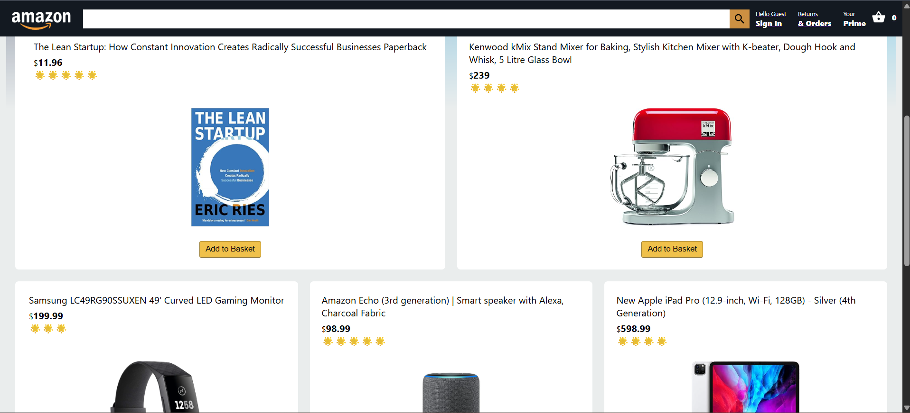
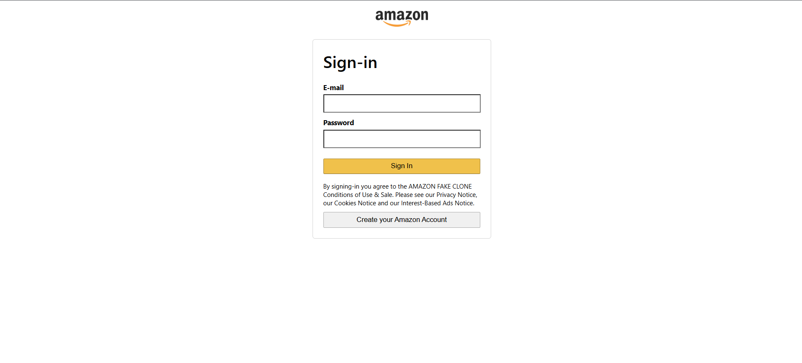
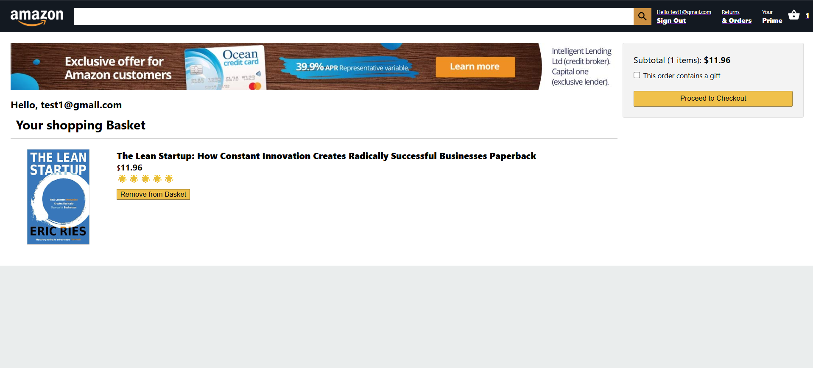
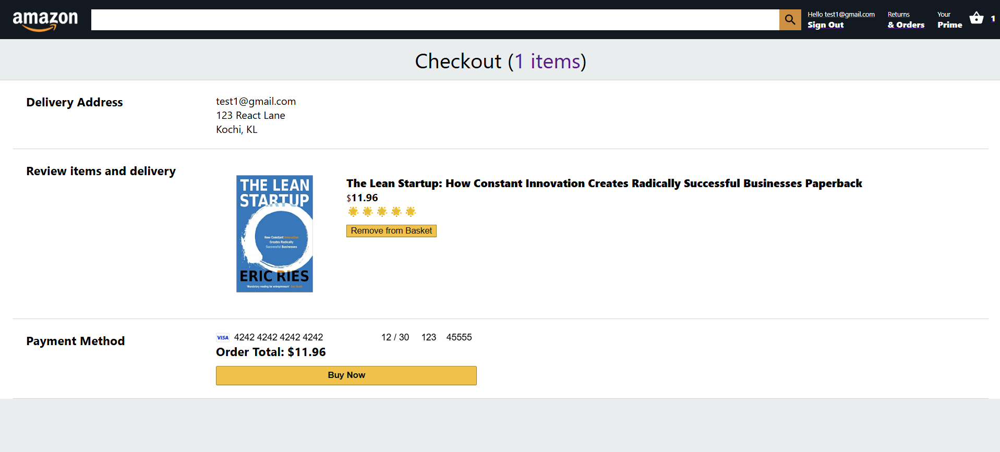
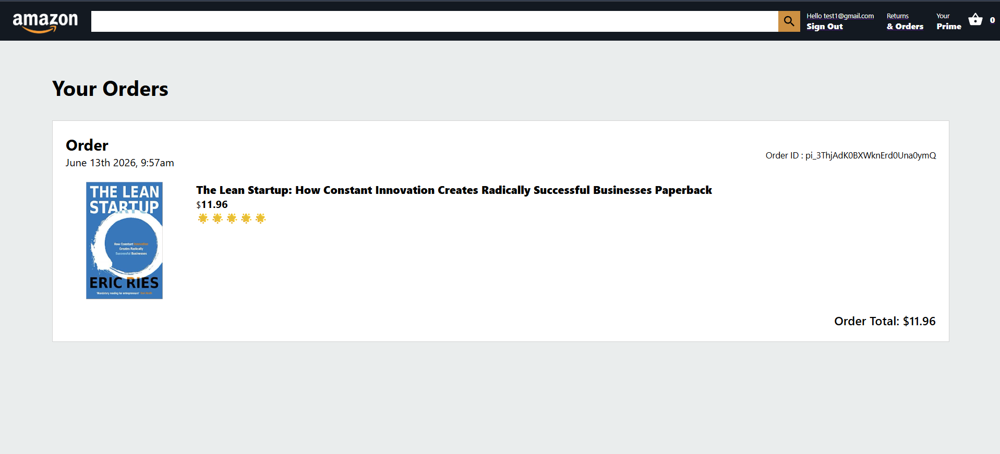

# Full-Stack Amazon Clone (E-Commerce Platform)

A fully functional e-commerce application featuring a complete shopping pipeline, secure user authentication, credit card processing via Stripe, and real-time user order history tracking.

## 🚀 Live Demo
* **Application:** https://clone-31b80.web.app/

---

## 📸 Application Walkthrough

### 1. Product Discovery & Authentication
| Home Page (Products Grid) | User Authentication |
| --- | --- |
|  |  |

### 2. Shopping Cart & Order Verification
| Checkout Page (Cart List & Subtotal) | Payments Page (Delivery Address & Stripe Integration) |
| --- | --- |
|  |  |

### 3. Order Completion
| Persistent Orders History |
| --- |
|  |

---

## 🛠️ Tech Stack & Architecture

To optimize performance and circumvent deployment locks on traditional serverless environments, this platform utilizes a decoupled distributed cloud architecture:

* **Frontend:** React.js, React Context API (State Management), Material-UI, Axios.
* **Database & Auth:** Cloud Firestore (NoSQL Database) & Firebase Authentication.
* **Hosting Platforms:**
  * **Firebase Hosting:** Delivers fast, secure distribution of static global assets on the Spark Tier.
  * **Render Web Services:** Hosts the dedicated, containerized Node/Express API logic completely isolated from third-party billing traps.
* **Payment Pipeline:** Node.js, Express.js, CORS, Stripe API wrapper.

---

## ✨ Core Features

* **Dynamic Shopping Cart:** Component-driven state machine managing product additions, deletions, and real-time subtotal/item counters.
* **Stripe Payment Gateway:** Fully tokenized frontend credit card input fields routing secure communication requests to isolated back-end Express endpoints.
* **User Authentication:** Multi-tier user account creation and secure session persistence backed by Firebase Auth tokens.
* **Cloud Firestore Orders Database:** Automates instantaneous transaction logging, storing historical card checkout datasets, and serving them dynamically to a customer accounts dashboard.
* **Responsive Layout:** Clean CSS-Grid and Flexbox implementation mimicking the desktop and mobile layouts of Amazon's production storefront.

---

## 🔧 Local Development Setup

Follow these steps to run a copy of this project locally on your machine:

### 1. Clone the Repository
\`\`\`bash
git clone https://github.com/NobleXavier7/amazon_clone.git
cd amazon_clone
\`\`\`

### 2. Setup Your Environment Variables
Create a `.env` file inside the `functions` directory:
\`\`\`text
STRIPE_SECRET_KEY=your_stripe_secret_key_here
\`\`\`

### 3. Install Frontend Dependencies
Run this in the root folder to install packages for the React UI:
\`\`\`bash
npm install
\`\`\`

### 4. Install Backend Dependencies
Navigate to the backend folder and install its core requirements:
\`\`\`bash
cd functions
npm install
cd ..
\`\`\`

### 5. Fire Up the Local Environments
Run both environments concurrently as separate local terminal instances:

* **Launch Frontend UI:**
\`\`\`bash
npm start
\`\`\`

* **Launch Backend Server:**
\`\`\`bash
cd functions && node index.js
\`\`\`

---

## 🌍 Deployment Summary Note
This layout resolves typical cloud deployment permissions blocks by stepping completely outside of restricted serverless infrastructures for runtime computing. The front-end assets deploy directly via standard Firebase static channels, while the backend utilizes an asynchronous continuous delivery model linked directly to Render's developer platform, providing efficient, zero-cost, persistent staging environments.
